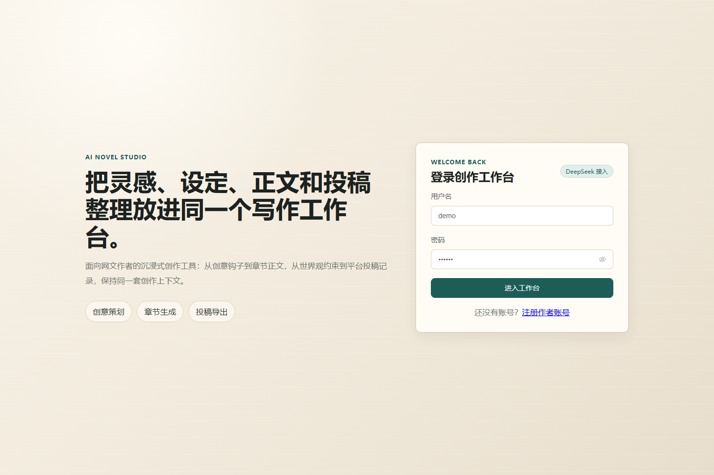
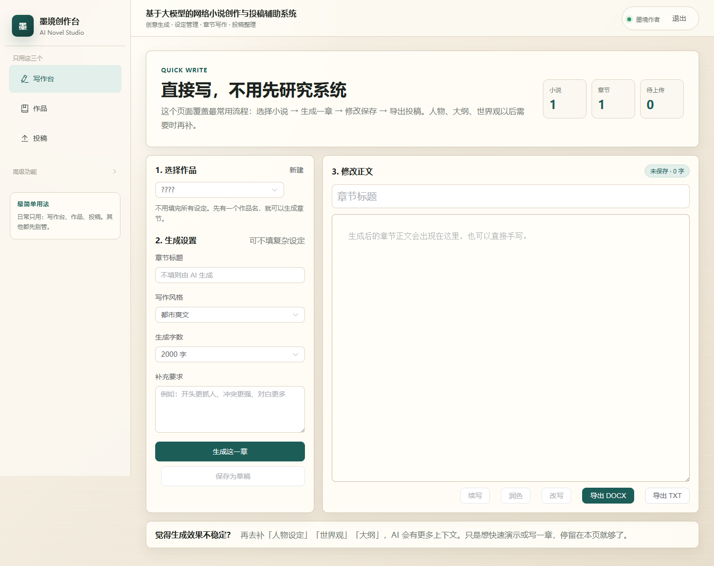
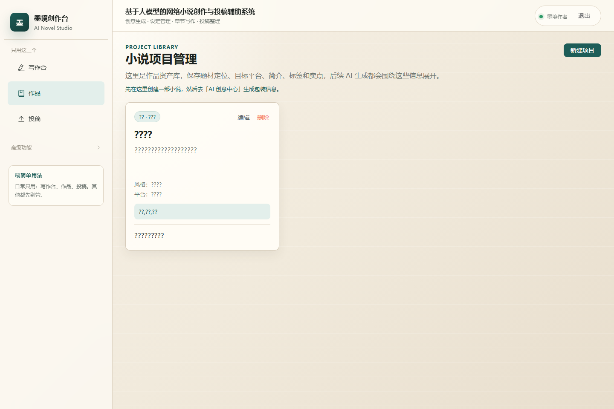
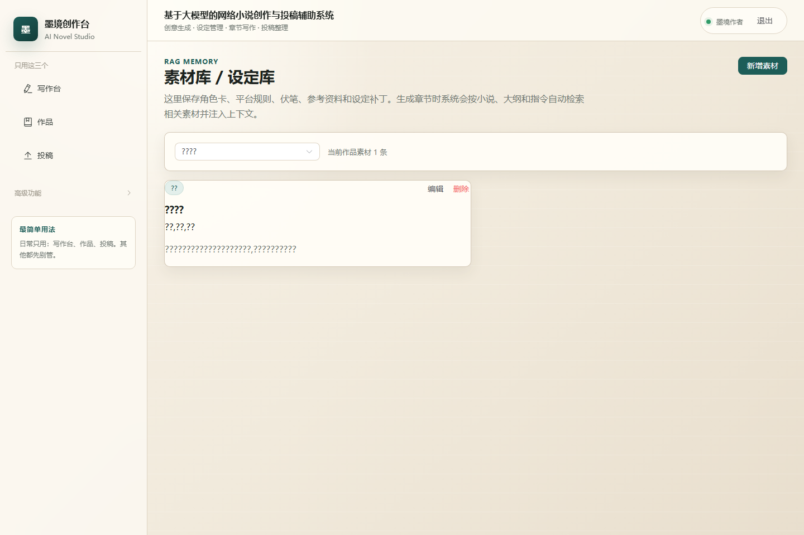
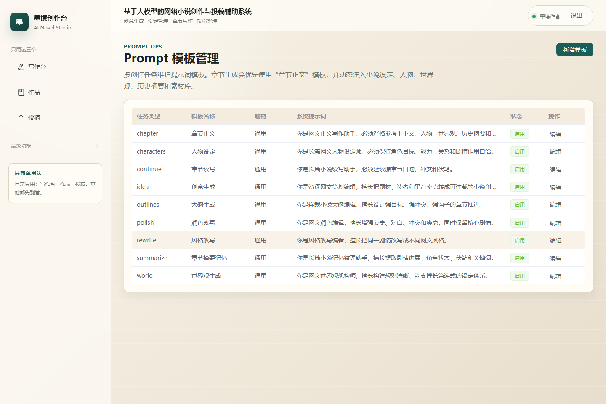
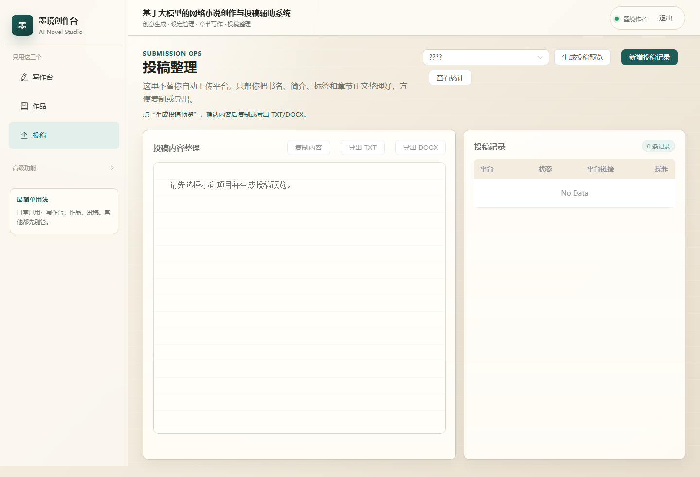
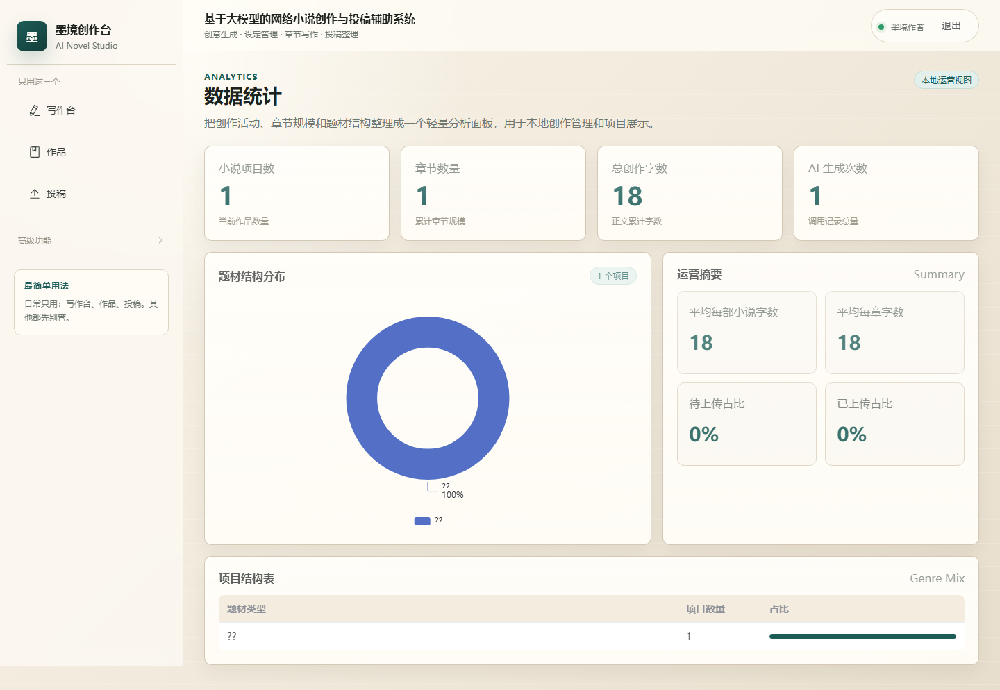

# 基于大模型的网络小说创作与投稿辅助系统

面向网络小说作者的一体化创作辅助系统，覆盖 AI 创意生成、人物设定、世界观管理、大纲生成、章节正文生成、续写润色、投稿整理、导出和数据统计。项目采用 FastAPI + Vue 3 + MySQL，默认没有 API Key 也可以使用 mock AI 完整演示流程。

## 技术栈

- 后端：FastAPI、SQLAlchemy、Pydantic、PyMySQL、JWT
- 前端：Vue 3、Vite、Element Plus、Pinia、Vue Router、ECharts
- 数据库：MySQL 8.x
- 部署：Docker Compose、Nginx

## 目录结构

```text
backend/                 FastAPI 后端服务
frontend/                Vue 3 前端应用
docs/                    API、Docker、RAG 与截图说明
docker-compose.yml       MySQL + 后端 + 前端一键启动
.env.docker.example      Docker 环境变量示例
PROJECT_STRUCTURE.md     详细项目结构
```

## 快速启动：Docker Compose

```bash
cp .env.docker.example .env
docker compose up -d --build
```

访问地址：

- 前端：`http://127.0.0.1:5173`
- 后端：`http://127.0.0.1:8000`
- Swagger：`http://127.0.0.1:8000/docs`

停止服务：

```bash
docker compose down
```

## 本地开发

### 1. 准备数据库

先在 MySQL 中创建数据库并导入表结构：

```sql
CREATE DATABASE IF NOT EXISTS novel_ai_writer
  DEFAULT CHARACTER SET utf8mb4
  COLLATE utf8mb4_unicode_ci;
USE novel_ai_writer;
SOURCE backend/database.sql;
```

如果使用 Navicat、DataGrip、DBeaver 等图形化工具，也可以直接打开 `backend/database.sql` 执行。

### 2. 启动后端

macOS / Linux：

```bash
cd backend
python3 -m venv .venv
source .venv/bin/activate
pip install -r requirements.txt
cp .env.example .env
python seed.py
uvicorn main:app --reload --host 127.0.0.1 --port 8000
```

Windows PowerShell：

```powershell
cd backend
python -m venv .venv
.\.venv\Scripts\Activate.ps1
pip install -r requirements.txt
Copy-Item .env.example .env
python seed.py
uvicorn main:app --reload --host 127.0.0.1 --port 8000
```

启动前请检查 `backend/.env` 中的 `DATABASE_URL` 用户名、密码和端口是否与本机 MySQL 一致。

### 3. 启动前端

```bash
cd frontend
npm install
npm run dev
```

访问 `http://127.0.0.1:5173`。

## 测试账号

```text
用户名：demo
密码：123456
```

也可以在注册页创建新账号。

## AI 配置

默认不配置 API Key 时，系统使用 mock AI，所有生成流程都能跑通。

如需接入 OpenAI 或兼容接口，在 `backend/.env` 配置：

```env
OPENAI_API_KEY=你的Key
OPENAI_MODEL=gpt-4o-mini
OPENAI_BASE_URL=
```

国产兼容 OpenAI 协议的大模型可填写对应 `OPENAI_BASE_URL`。

## 常用命令

```bash
# 前端生产构建
cd frontend && npm run build

# 查看 Docker 日志
docker compose logs -f backend
docker compose logs -f frontend

# 重置 Docker 数据库卷
docker compose down -v
```

## 功能演示流程

1. 登录或注册。
2. 在「小说项目」创建项目。
3. 在「AI 创意生成」输入题材、关键词、目标读者、故事基调，生成并保存到项目。
4. 在「人物设定」生成主角、配角、反派或重要人物。
5. 在「世界观管理」生成世界背景、组织、等级、能力规则和禁忌。
6. 在「大纲生成」生成全书、分卷和章节大纲，并批量保存。
7. 在「章节正文生成」选择大纲、字数和风格，生成正文并保存草稿。
8. 使用右侧 AI 助手执行续写、润色或改写。
9. 在「章节管理」标记章节为待上传或已上传。
10. 在「投稿辅助」生成投稿预览，一键复制，或导出 txt/docx。
11. 新增投稿记录，填写目标平台、状态、链接和备注。
12. 在「AI生成历史」查看每次生成记录。
13. 在「数据统计」查看字数、章节、AI 生成次数和类型分布。

## 生产化增强

- JWT Bearer 登录认证：支持前端 JSON 登录和 Swagger OAuth2 登录。
- 接口文档：启动后访问 `http://127.0.0.1:8000/docs` 或查看 `docs/API.md`。
- 统一异常处理：错误响应包含 `code/message/detail/path`。
- 请求日志：后端日志写入 `logs/backend.log`。
- AI 调用指标：记录耗时、prompt tokens、completion tokens、total tokens、失败原因和重试次数。
- Docker Compose：查看 `docs/DOCKER.md`，可一键启动 MySQL、后端和前端。

## 系统截图








